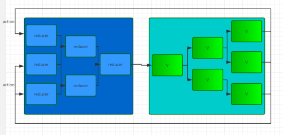

# React技术栈

### Flux

Flux 是一种应用架构，或者说是一种思想，它跟 React 本身没什么关系，它可以用在 React 上，也可以用在别的框架上。前面说到 Flux 在 React 中主要用来统一管理引起 state 变化的情况。Flux 维护着一个或者多个叫做 Store 的变量，就像 MVC 里面的 Model，里面存放着应用用到的所有数据，当一个事件触发时 ，Flux 对事件进行处理，对 Store 进行更新，当 Store 发生变化时，通常是由应用的根组件（也叫 controller view）去获取最新的 store，然后更新 state，之后利用 React 单向数据流的特点一层层将新的 state 向下传递实现 view 的更新。这里的 controller view 可以有多个也可以不是根组件，但是这样数据流维护起来就比较麻烦。

Flux 的思维模型如下：

Flux 主要包括四个部分， Dispatcher 、 Store 、 View 、 Action ，其中 Dispatcher 是 Flux 的核心枢纽，它相当于是一个事件分发器，将那些分散在各个组件里面的逻辑代码收集起来，统一在 Dispatcher 中进行处理。完整的 Flux 处理流程是这样的：用户通过与 view 交互或者外部产生一个 Action，Dispatcher 接收到 Action 并执行那些已经注册的回调，向所有 Store 分发 Action。通过注册的回调，Store 响应那些与他们所保存的状态有关的 Action。然后 Store 会触发一个 change 事件，来提醒 controller-views 数据已经发生了改变。Controller-views 监听这些事件并重新从 Store 中获取数据。这些 controller-views 调用他们自己的 setState() 方法，重新渲染自身以及组件树上的所有后代组件。使用 Flux 有个好处就是我只需要用 action 对象向 Dispatcher 描述当前的事件就可以执行对应的逻辑，因为 Dispatcher 是所有 Action 的处理中心，即使没有对应的事件发生，我们也可以“伪造”一个出来，非常利于测试。

### Redux

Redux 的作用跟 Flux 是一样的，它可以看作是 Flux 的一种实现，但是又有点不同，具体的不同总结起来就是：

1. Redux 只有一个 store Flux 里面会有多个 store 存储应用数据，并在 store 里面执行更新逻辑，当 store 变化的时候再通知 controller-view 更新自己的数据，Redux 将各个 store 整合成一个完整的 store，并且可以根据这个 store 推导出应用完整的 state。同时 Redux 中更新的逻辑也不在 store 中执行而是放在 reducer 中。
2. 没有 Dispatcher Redux 中没有 Dispatcher 的概念，它使用 reducer 来进行事件的处理，reducer 是一个纯函数，这个函数被表述为 (previousState, action) => newState ，它根据应用的状态和当前的 action 推导出新的 state。Redux 中有多个 reducer，每个 reducer 负责维护应用整体 state 树中的某一部分，多个 reducer 可以通过 combineReducers 方法合成一个根reducer，这个根reducer负责维护完整的 state，当一个 action 被发出，store 会调用 dispatch 方法向某个特定的 reducer 传递该 action，reducer 收到 action 之后执行对应的更新逻辑然后返回一个新的 state，state 的更新最终会传递到根reducer处，返回一个全新的完整的 state，然后传递给 view。

Redux 和 Flux 之间最大的区别就是对 store/reducer 的抽象，Flux 中 store 是各自为战的，每个 store 只对对应的 controller-view 负责，每次更新都只通知对应的 controller-view；而 Redux 中各子 reducer 都是由根reducer统一管理的，每个子reducer的变化都要经过根reducer的整合。用图表示的话可以像这样：

Flux 中的 store 是这样的：

Redux 中的 store（或者叫 reducer）是这样的：

### React Router
在 web 应用开发中，路由系统是不可或缺的一部分。在浏览器当前的 URL 发生变化时，路由系统会做出一些响应，用来保证用户界面与 URL 的同步。随着单页应用时代的到来，为之服务的前端路由系统也相继出现了。React Router是React官方维护的路由，事实上也是唯一可选的路由库。它通过管理 URL，实现组件的切换和状态的变化，开发复杂的应用几乎肯定会用到。

### dva
使用 redux ,并认可这种数据流的控制可以让应用更可控，以及让逻辑更清晰。但随之而来通常会有这样的疑问：概念太多，并且 reducer, saga, action 都是分离的（分文件）。
这带来的问题是：

- 编辑成本高，需要在 reducer, saga, action 之间来回切换
- 不便于组织业务模型 (或者叫 domain model) 。比如我们写了一个 userlist 之后，要写一个 productlist，需要复制很多文件。
- saga 书写太复杂，每监听一个 action 都需要走 fork -> watcher -> worker 的流程
- entry 书写麻烦
- ...

而 dva 正是用于解决这些问题。

dva 是基于现有应用架构 (redux + react-router + redux-saga 等)的一层轻量封装，没有引入任何新概念，全部代码不到 100 行。( Inspired by elm and choo. )

dva 是 framework，不是 library，类似 emberjs，会很明确地告诉你每个部件应该怎么写，这对于团队而言，会更可控。另外，除了 react 和 react-dom 是 peerDependencies 以外，dva 封装了所有其他依赖。
